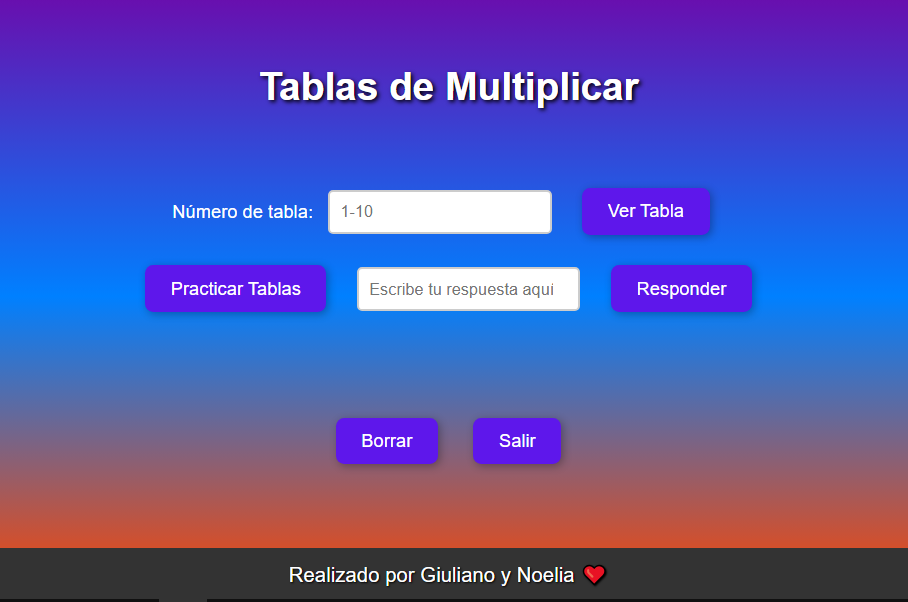
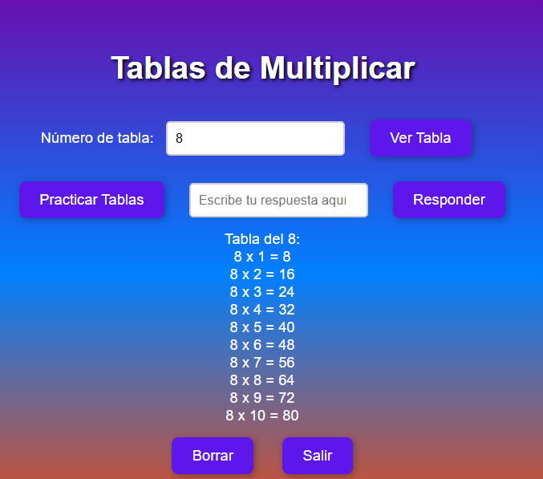
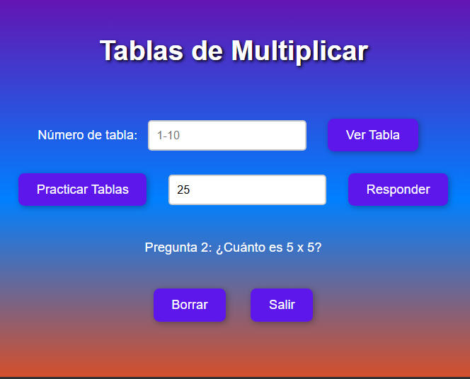
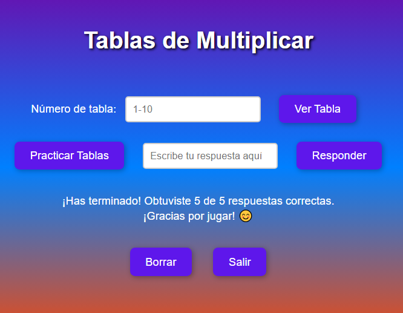
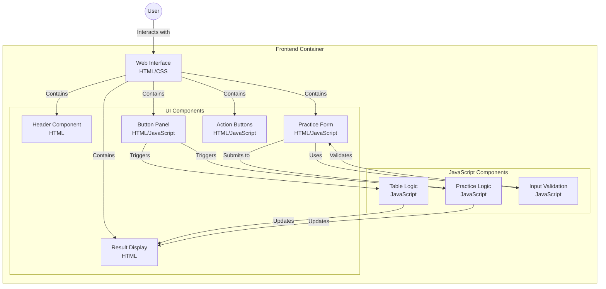

# Proyecto de JavaScript: Tabla de Multiplicar y Práctica

Este es el primer proyecto realizado entre un niño de 10 años y su madre, ambos estudiantes que decidieron aprender juntos y crear algo divertido y útil. Ambos participaron en el proceso de desarrollo con la idea de hacerlo accesible y divertido, usando JavaScript para aprender conceptos clave de programación, como el uso de funciones, bucles, y manipulación de DOM.

El proyecto fue diseñado pensando en el día a día de los estudiantes, con el objetivo de hacer más fácil y entretenido el aprendizaje de la tabla de multiplicar y las operaciones matemáticas básicas. A lo largo de este proyecto, madre e hijo trabajaron juntos para crear una herramienta interactiva que ayudará a mejorar las habilidades matemáticas de manera divertida.

## Tecnologías Utilizadas

- **HTML**: Para estructurar el contenido de la página.
- **CSS**: Para diseñar la interfaz de usuario con un fondo degradado y botones interactivos.
- **JavaScript**: Para agregar funcionalidad, como la generación de la tabla de multiplicar y la interacción con el usuario.
- **VS Code**: Editor de código utilizado para desarrollar el proyecto.
- **Extensiones**: Amazon Q y Codeviz para diagramar el flujo del proyecto.

## Funcionalidad

Este proyecto permite al usuario:



1. Ingresar un número de la tabla de multiplicar (del 1 al 10) y ver la tabla completa.



2. Practicar multiplicación con preguntas interactivas y obtener retroalimentación inmediata sobre si las respuestas son correctas o no.



3. Ver un resultado final después de 5 preguntas de práctica.




### Características Principales

1. **Mostrar la Tabla de Multiplicar**: El usuario puede ingresar un número entre 1 y 10 y el sistema mostrará la tabla de multiplicar de ese número.
2. **Modo de Práctica**: El usuario puede responder preguntas de multiplicación de manera aleatoria. Se le harán 5 preguntas, y al final se mostrará el puntaje obtenido.
3. **Interactividad y Retroalimentación**: Cada vez que el usuario responde correctamente o incorrectamente, se le da un mensaje de retroalimentación inmediato.
4. **Botones de Control**: Los botones permiten limpiar los campos o salir de la aplicación para reiniciar la experiencia.

## Explicación del Proyecto

Este proyecto ha sido diseñado para principiantes en JavaScript. La estructura de la página y la interacción con el usuario son simples, lo que lo hace adecuado para estudiantes jóvenes, como un niño de 10 años, y sus padres que deseen aprender junto a él.

### Bucle `for`

El bucle `for` es utilizado para generar las tablas de multiplicar. A continuación, te explicamos cómo se aplica:

```javascript
for (let i = 1; i <= 10; i++) {
    resultado += `${tabla} x ${i} = ${tabla * i}\n`;
}
```

### ¿Qué hace este bucle?
El bucle for se ejecuta 10 veces (de 1 a 10) y en cada iteración calcula y muestra una línea de la tabla de multiplicar para el número elegido por el usuario.
Uso en el Proyecto: Esta estructura permite generar dinámicamente la tabla completa de multiplicar, desde la multiplicación de 1 hasta 10 por el número proporcionado por el usuario.
Funciones Utilizadas
El proyecto contiene varias funciones que gestionan las distintas partes de la lógica:

mostrarTabla(): Esta función se encarga de mostrar la tabla de multiplicar del número ingresado por el usuario. Valida si el número es válido y luego genera la tabla correspondiente.
practicar(): Inicializa el modo de práctica, configurando las variables para contar las preguntas y el puntaje.
generarNuevaPregunta(): Esta función genera una nueva pregunta aleatoria de multiplicación.
verificarPractica(): Se encarga de verificar la respuesta del usuario. Si la respuesta es correcta, incrementa el puntaje; si es incorrecta, muestra la respuesta correcta.
mostrarResultadoFinal(): Muestra el resultado final después de responder las 5 preguntas, indicando cuántas respuestas correctas tuvo el usuario.
borrar(): Permite limpiar los campos de entrada y los resultados de la página.
salir(): Cierra la aplicación y muestra un mensaje de despedida.

## Diagrama del Proyecto

A continuación se presenta un diagrama generado con Codeviz, que muestra la estructura y el flujo de las interacciones en el proyecto:


## Video del proyecto:
En el siguiente video se puede ver el funcionamiento del programa que ha realizado Giuliano.

https://youtu.be/7AFtAWkLoKM

y lo podés probar aquí: 
https://noeliaorsini.github.io/TABLAS-DE-MULTIPLICAR/


## Agradecimientos

Queremos agradecer a ChatGPT por la asistencia brindada en la creación de este proyecto. Gracias a su apoyo, hemos aprendido a utilizar la nueva extensión CodeViz y mejorar tanto la estética como la funcionalidad de nuestro sistema, como la implementación del puntaje y otros detalles importantes. Este proyecto ha sido una excelente forma de aprender y aplicar lo que hemos descubierto en estos 6 meses de exploración en el mundo de la tecnología.

